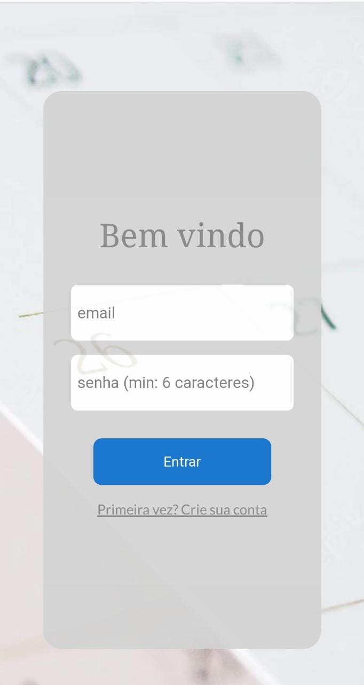
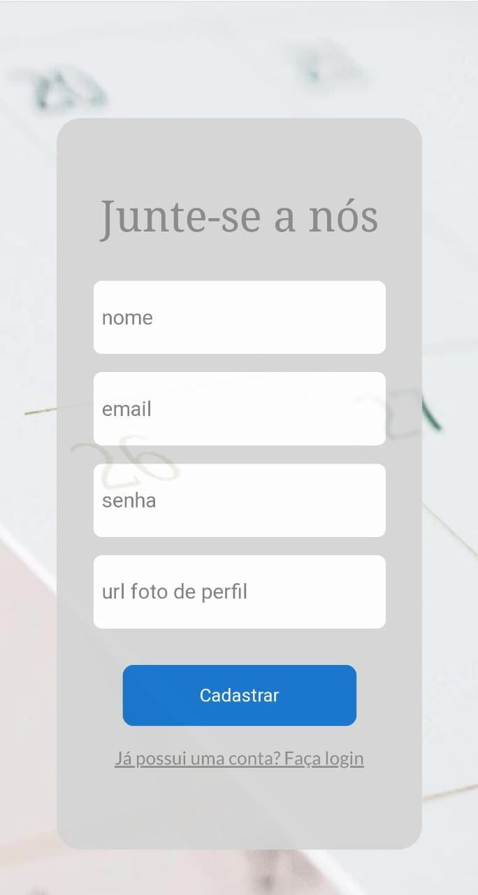
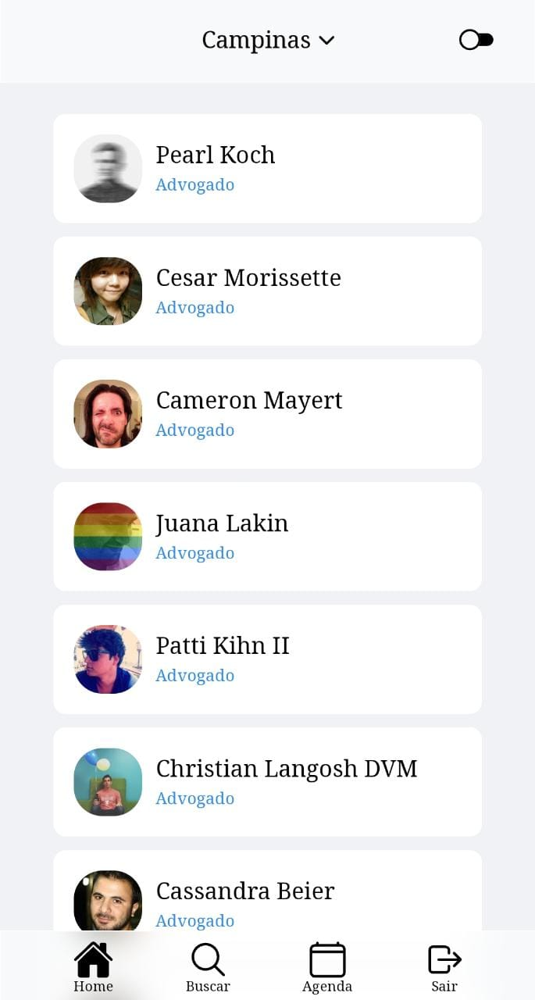
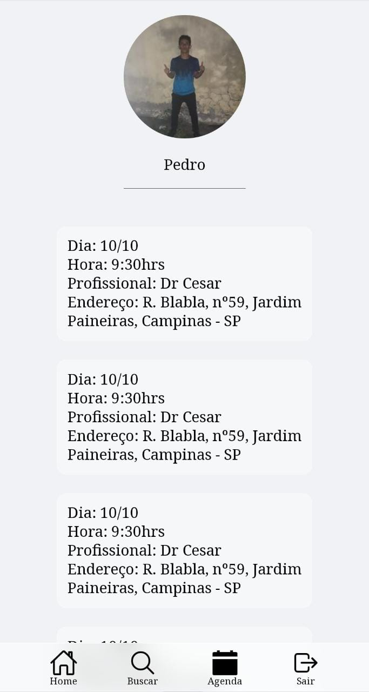
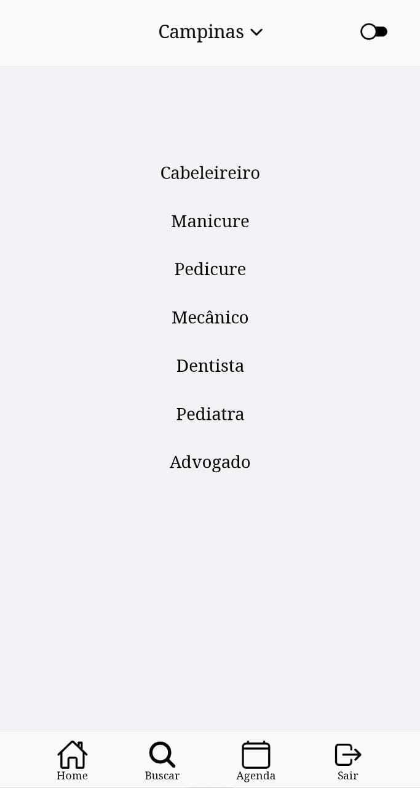
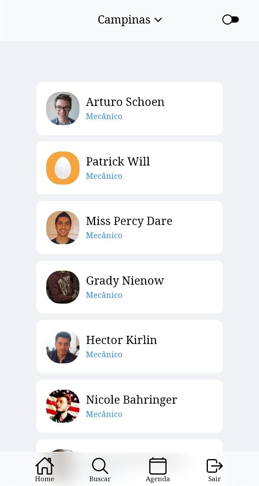

# Schedule---Front
A ideia desta aplicação é a disponibilização da agenda de profissionais com potenciais clientes. 
Uma outra aplicação está sendo desenvolvida para o cadastro de profissionais, por enquanto, o deploy possui dados fakes.

## :clipboard: Descrição
Imagine que você está de férias em uma cidade diferente e precisa urgentemente de um pediatra, ou algo menos urgente, como cortar o cabelo, mas você não
sabe onde encontrar. Schedule vem para sanar essa dor, uma enciclopédia de profissionais de diversas áreas onde você pode filtrar pela cidade e pelo 
serviço prestado.

---

## :computer: Tecnologias e Conceitos

- SPA
- React
- Axios
- Styled-components
- eslint

---

## :rocket: Páginas

```yml
SignIn
```



```yml
SignUp
```


```yml
Home
    - Página de exibição de profissionais filtrados por cidade
```


```yml
MySchedule (em construção)
    - Página de exibição de agendamentos do usuário
```


```yml
Search
    - Página para pesquisa de profissionais por serviço
```


```yml
Service
    - Página de exibição de profissionais filtrados por cidade e serviço prestado
```


---

## 🏁 Rodando a aplicação

Certifique-se que você possui a última versão estável do [Node.js](https://nodejs.org/en/download/) e [npm](https://www.npmjs.com/) rodando localmente.

Clone este repositório em sua máquina:

```
git clone https://github.com/phbodias/Schedule---Front
```

Dentro da pasta do projeto, rode o seguinte comando para instalar as dependências necessárias:
```
npm install
```

Crie e configure um arquivo ".env", com base no arquivo ".env-example"

Feito isso, rode a aplicação com:

```
npm start
```
---

Caso você queira profissionais fictícios para exibição, clone e rode também o repositório [back-end](https://github.com/phbodias/Schedule---Back.git).
